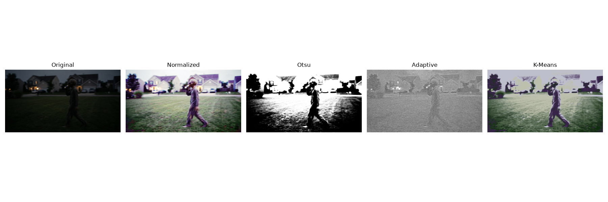
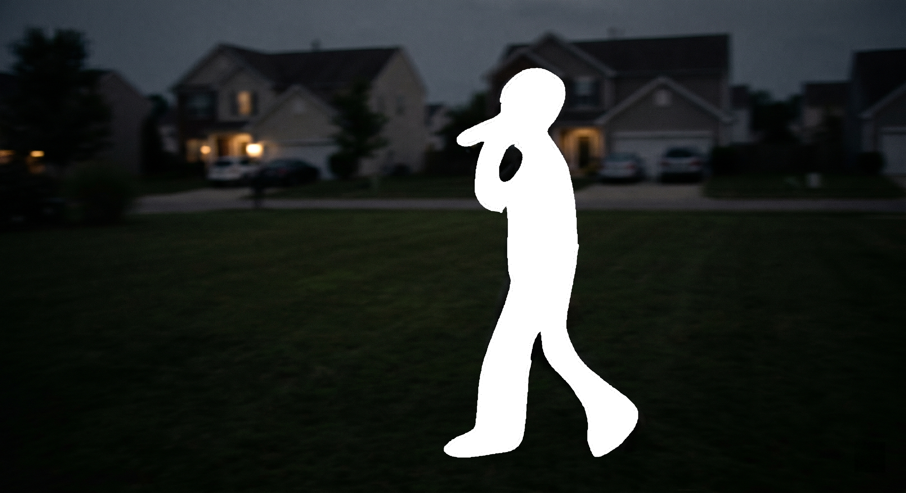
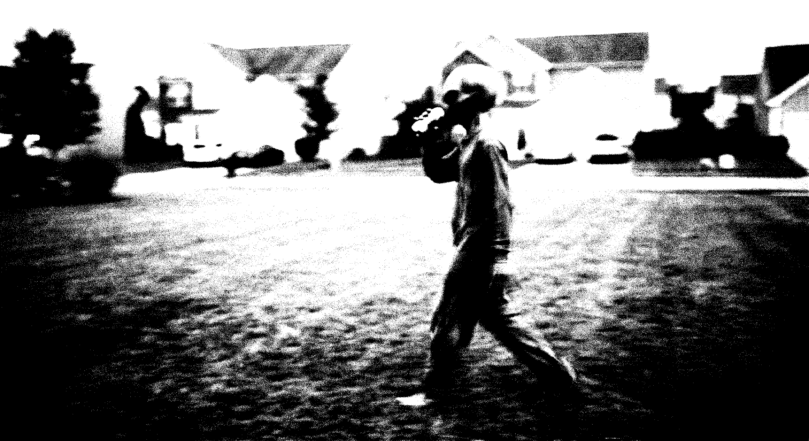
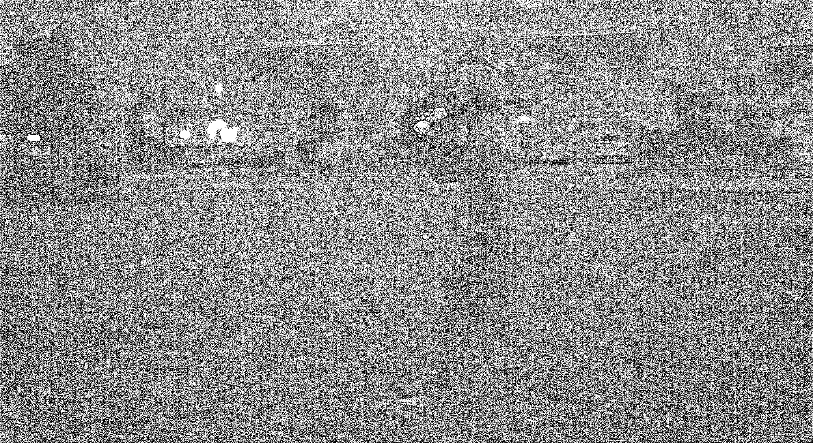
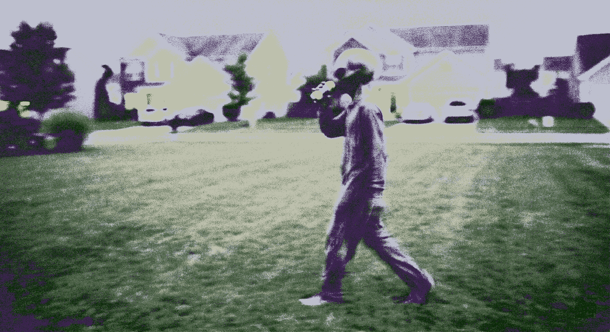
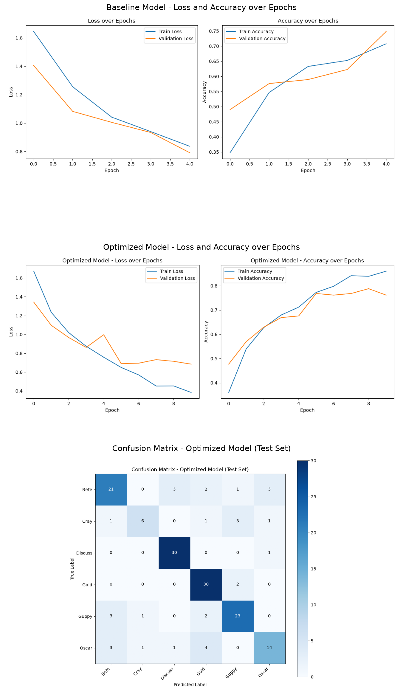

# CS898BA Project 1

## Student Information

Name: Siji Gokuldas

## Project Overview

This project was completed for CS898BA. The goal of the assignment was to perform image analysis and image processing using Python and OpenCV. Different image transformations, color space conversions, blurring techniques, and edge detection methods were applied to the provided image.

## Software and Libraries Used

* Python
* OpenCV
* NumPy
* Matplotlib

## How to Run the Program

1. Install the required libraries listed in requirements.txt.
2. Open the project folder in VS Code.
3. Open a terminal in the project directory.
4. Run the following command:

python src/load_image.py

## Tasks Completed

* Calculated image statistics
* Converted the image to grayscale
* Created a binary image
* Converted the image to HSV, LAB, and HLS color spaces
* Applied histogram equalization on the HSV image
* Converted the normalized image back to RGB
* Performed affine transformations
* Applied Gaussian blur with different sigma values
* Created four random subsets
* Applied Sobel edge detection
* Applied Laplacian edge detection
* Applied Canny edge detection
* Applied Prewitt edge detection

## Results

The project successfully generated all required output images. Different image processing techniques were used to analyze and improve the image. The edge detection methods produced different results, allowing comparison of their performance on the dataset.

## Gaussian Blur Analysis

Gaussian blur was applied using sigma values of 0.5, 1.0, 1.5, 2.0, 2.5, 3.0, and 3.5. As the sigma value increased, the images became smoother and less detailed. Lower sigma values preserved most image features while reducing minor noise. Higher sigma values produced stronger blurring and removed more image details.

## Edge Detection Analysis

Four edge detection techniques were applied to the selected subset of images.

### Sobel
Sobel detected major edges and object boundaries clearly while maintaining a good balance between detail and noise reduction.

### Laplacian
Laplacian detected fine intensity changes but was more sensitive to noise and produced additional edge responses in some images.

### Canny
Canny generated thin and precise edges. However, due to the dark nature of the original image, some important details were not consistently detected.

### Prewitt
Prewitt produced results similar to Sobel but with slightly weaker edge responses and fewer detected details.

## Best Performing Method

Based on visual comparison of the generated outputs, Sobel provided the most useful and consistent edge detection results for this dataset. It highlighted the major outlines of objects while reducing unnecessary noise.

## Conclusion

This project demonstrated image analysis and image processing techniques using Python and OpenCV. The assignment included image statistics, color space conversion, histogram equalization, affine transformations, Gaussian blurring, image subset creation, and edge detection. The generated outputs showed how different techniques affect image quality and feature extraction. Overall, Sobel produced the most effective edge detection results for the selected image subset.


# Homework 2 - Image Segmentation

## Segmentation Methods

The following segmentation methods were implemented:

 Otsu Thresholding
 Adaptive Thresholding
 K-Means Clustering

## Comparison of Results



## Segmentation Masks

**Ground Truth**



**Otsu Thresholding**



**Adaptive Thresholding**



**K-Means Clustering**



## Analysis

The original image was first normalized to improve the color balance before applying different segmentation methods.

 Otsu Thresholding separated the foreground from the background, but some background regions were also included because of the uneven lighting.
 Adaptive Thresholding handled the lighting variation better, but it also introduced more noise in the background.
 K-Means Clustering grouped pixels based on color similarity. It preserved more color information, although some background objects were still grouped with the person.
 For K-Means, K = 5 was selected, meaning the image was grouped into 5 color clusters. This value was chosen to balance detail and simplicity — a lower K (like 2 or 3) risked merging the person with the background, while a higher K would have created too many small, fragmented regions instead of one clear foreground group.

Based on the visual comparison, Adaptive Thresholding provided the clearest separation of the person, while K-Means preserved more image details.
It is also worth noting that the original image was captured in low-light/dusk conditions. This darkness likely contributed to the relatively low IoU and Dice scores across all three methods, since low contrast between the person and the background makes it harder for any thresholding or clustering method to draw a precise boundary.

During evaluation, it was also discovered that some of the raw segmentation masks had inverted pixel values (foreground and background reversed) compared to the ground truth mask. This was corrected by adding an automatic inversion check: each mask is compared against the ground truth in both its original and inverted form, and whichever version produces a higher IoU is used for the final metric calculation. This ensures the scores reflect true segmentation accuracy rather than a labeling mismatch.

## Evaluation Metrics

The segmentation methods were compared using Intersection over Union (IoU) and Dice Coefficient with a manually created reference mask.

| Method | IoU | Dice |
|--------|------:|------:|
| Otsu | 0.1006 | 0.1829 |
| Adaptive | 0.0658 | 0.1235 |
| K-Means | 0.0896 | 0.1644 |

## Conclusion

This assignment explored different image segmentation techniques and compared their performance using both visual inspection and evaluation metrics. The comparison figure helped visualize the strengths and weaknesses of each method. Among the three methods, Adaptive Thresholding gave the best overall separation of the person in this image, while K-Means preserved more color information.

## Directory Structure

```
SijiGokuldas_CS898BA_Project1/
├── data/
│   └── HW1_IMG_CS898BA.png
├── output/
│   ├── affine/
│   ├── binary/
│   ├── blur/
│   ├── canny/
│   ├── grayscale/
│   ├── ground_truth/
│   ├── hls/
│   ├── hls.png
│   ├── hsv/
│   ├── lab/
│   ├── laplacian/
│   ├── prewitt/
│   ├── segmentation_output/
│   ├── subset1/
│   ├── subset2/
│   ├── subset3/
│   ├── subset4/
│   └── comparison_plot.png
├── src/
│   ├── segmentation/
│   │   ├── comparison_plot.py
│   │   ├── evaluation.py
│   │   └── main_segmentation.py
│   └── load_image.py
├── AI_Log.md
├── hello.py
├── README.md
└── requirements.txt
```

# Homework 3 - Deep Learning for Fish Classification

## Dataset

A locally provided fish dataset containing 6 species (Discus, Goldfish, Guppy, Oscar, Betta, Crayfish) was used, totaling 1,016 images. Class sizes varied naturally (80–207 images per species). The dataset was split into training (70%), validation (15%), and test (15%) sets using a fixed random seed for reproducibility, resulting in 708 training, 151 validation, and 157 test images.

## Data Preprocessing and Augmentation

All images were resized to 128x128 pixels and normalized to a [-1, 1] pixel range. Data augmentation (random horizontal flips, random rotation up to 10 degrees, and brightness jitter) was applied only to the training set to improve generalization and reduce overfitting. No augmentation was applied to validation/test data, since those sets are meant to reflect real, unmodified performance.

## Baseline CNN

A CNN with 3 convolutional layers (32, 64, 128 filters), ReLU activation, and max-pooling was built from scratch, followed by a dense layer with dropout (0.3) and a final classification layer. Trained for 5 epochs with Adam optimizer, learning rate 0.001, and batch size 32.

**Baseline Results:** 86.11% validation accuracy, 0.3714 validation loss (final epoch).

## Hyperparameter Tuning

A Grid Search strategy was used, systematically testing six configurations by varying learning rate (0.01, 0.001, 0.0001), batch size (32, 64), and dropout rate (0.3, 0.5). Each configuration was trained for 3 epochs and compared by validation loss.

| Learning Rate | Batch Size | Dropout | Val Loss | Val Accuracy |
|---|---|---|---|---|
| 0.01 | 32 | 0.3 | 1.2695 | 52.32% |
| 0.001 | 32 | 0.3 | 0.9266 | 65.56% |
| 0.0001 | 32 | 0.3 | 1.1630 | 58.94% |
| 0.001 | 64 | 0.3 | 1.0109 | 62.25% |
| 0.001 | 32 | 0.5 | 1.0061 | 62.91% |
| 0.001 | 64 | 0.5 | 1.1389 | 57.62% |

**Findings:** A learning rate of 0.01 was too high, resulting in unstable training and the worst validation loss. Learning rate 0.001 consistently performed best across all trials, with performance degrading at both the higher (0.01) and lower (0.0001) extremes. Increasing dropout to 0.5 did not improve results, and batch size 32 slightly outperformed 64. The best configuration (learning rate 0.001, batch size 32, dropout 0.3) matched the original baseline settings, confirming the baseline was already well-tuned for this small dataset.

## Optimized Model

Using the best configuration identified through tuning, a final model was trained for 10 epochs (double the baseline) to allow more complete learning.

**Optimized Results:** 76.16% validation accuracy (final epoch), peaking at 78.81% at epoch 9, with validation loss of 0.6848.

## Training Visualizations

The image below shows a side-by-side comparison of the baseline and optimized models' training/validation loss and accuracy curves, along with the confusion matrix for the optimized model on the test set.



## Test Set Evaluation

Both models were evaluated on the held-out test set (157 images, unseen during training or validation). The baseline model achieved 75.80% test accuracy, while the optimized model achieved 78.98% test accuracy — confirming the improvement from tuning and longer training held up on genuinely unseen data. The optimized model showed particularly strong gains in recall for Discus (96.77%) and Gold (93.75%), while Crayfish (the smallest class, only 80 images total) remained the hardest to classify for both models due to limited training examples. Full precision, recall, and F1-score tables for both models are available in `output/classification_reports.txt`.

## Confusion Matrix Analysis

The confusion matrix for the optimized model (`output/confusion_matrix.png`) shows strong diagonal performance on the better-represented classes (Discus, Gold, Guppy), while Crayfish and Oscar—the two smallest classes—showed more misclassification, consistent with their lower support in the test set (12 and 23 images respectively) and their comparatively lower F1-scores.

## Conclusion

This assignment involved building a CNN from scratch to classify 6 fish/aquatic species from a small, naturally imbalanced local dataset, then systematically tuning hyperparameters to identify the optimal configuration. Learning rate had the largest impact on performance, with 0.001 proving optimal, while learning rate 0.01 caused unstable training. The final optimized model achieved 78.98% test accuracy, a meaningful improvement over the 75.80% baseline, though overall performance was naturally lower than a similarly-scoped task on a larger, more balanced dataset would produce, given the dataset's small size (1,016 images total) and class imbalance.